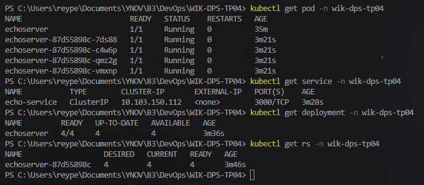

# WIK-DPS-TP04
    DevOps TP 4: Produire les fichiers YAML nécessaires et les <b>conserver</b> pour les communiquer lors du rendu.

##  SOMMAIRE
- [WIK-DPS-TP04](#wik-dps-tp04)
  - [SOMMAIRE](#sommaire)
  - [I. Sujet (checkList)](#i-sujet-checklist)
  - [II. Plus d'informations](#ii-plus-dinformations)
  

## I. Sujet (checkList)

- [X] Créer un Pod pour déployer l'image registry.cluster.wik.cloud/public/echo 
  - [X] Faire un port-forwarding entre le port du Pod sur lequel votre API écoute et un port sur votre hôte [resultat ici](asset/simplePod.png)
- [X] Remplacer le Pod par un ReplicaSet afin de déployer 4 réplicas du Pod créé précédemment
- [ ] Remplacer le ReplicaSet par un Deployment afin de pouvoir définir une stratégie d'update en RollingRelease (50% en maxUnavailable)
- [X] Créer un Service pour pouvoir communiquer avec les Pod du ReplicaSet créé précédemment
  - [X] Faire un port-forwarding entre le port du Service sur lequel l'API écoute et un port de l'hôte
- [ ] Activer le plugin ingress nginx sur minikube et créer un Ingress (nom de domaine au choix) pour communiquer avec le Service créé précédemment.


## II. Plus d'informations

Afin d'intérargir avec chaque étape, il ne faut pas omettre un ```-n wik-dps-tp04``` avec chaque commande mise à part le ```kubectl apply -f .\WIK-DPS-TP04.yaml```

Voici notre état avant d'intégrer ingress:
